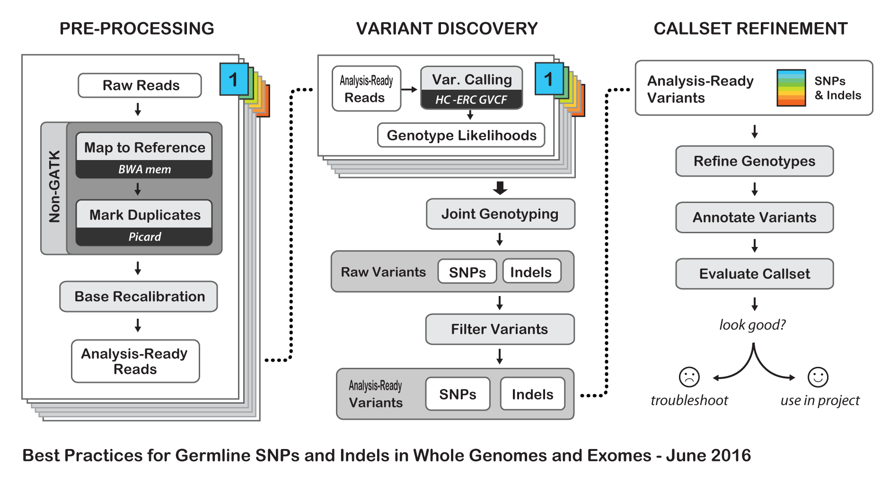
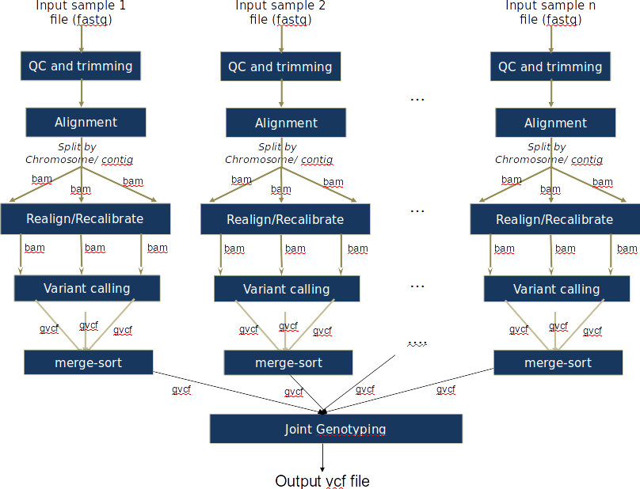
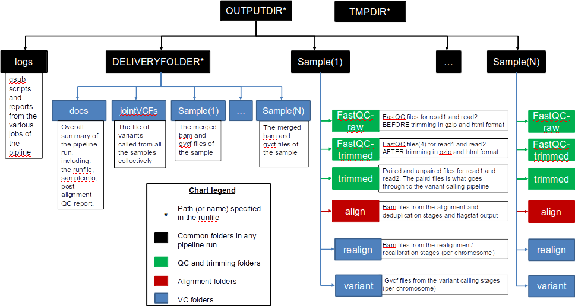

October 2016

1 Pipeline architecture and function
====================================

This pipeline implements the GATK's best practices for germline variant
calling in Whole Genome and Whole Exome Next Generation Sequencing
datasets
([*https://software.broadinstitute.org/gatk/best-practices/*](https://software.broadinstitute.org/gatk/best-practices/)),
given a cohort of samples.

In its latest version, 3.6, the best practices include the stages shown
in Figure \[1\] below, which are:

1.  Mapping to the reference genome

2.  Marking duplicates

3.  Base recalibration (BQSR)

4.  Variant calling –----- (processing done per sample)

5.  Joint genotyping –----- (processing done for all samples together)

These stages are implemented in this pipeline, with an optional “Indel
Realignment” step (which was recommended in previous GATK best practices
&lt; 3.6)

With an optional additional stage of checking the quality of input data
and trimming, the pipeline can also be run as: Alignment stage only,
Complete variant calling with realignment and Complete variant calling
without realignment depending on the user’s ANALYSIS setting.

{width="6.697916666666667in"
height="3.316666666666667in"}

Figure 1: Best Practices for Germline SNPs and Indels in Whole Genomes
and Exomes

Under the hood, this pipeline splits and merges files at different
stages to achieve optimal usage of resources. This parallelization of
data processing is shown in Figure \[2\] below:

{width="6.692716535433071in" height="5.125in"}

Figure 2: Pipeline details. Note the processing can be split by
individual sequences in the reference FASTA file. Those could be
individual chromosomes, scaffolds, contigs, etc.

2 Dependencies
==============

2.1 Software tools
------------------

The pipeline implements the stages of Figure \[1\] and \[2\], while
allowing different software tools at some of the stages depending on
user's preference. These are as shown in table \[1\] below, and it is
assumed that users would specify the path to each of them in their
runfile as shown in section 2.3.

Table 1: Pipeline tools

  ---------------------------------------------------------------------------------------------------------------------------------------------------------------------------------------------------------------------------------------------------------------------------------------------------------------
  **Stage**                   **Tool options**
  --------------------------- -----------------------------------------------------------------------------------------------------------------------------------------------------------------------------------------------------------------------------------------------------------------------------------
  Quality control             Fastqc ([*http://www.bioinformatics.babraham.ac.uk/projects/fastqc/*](http://www.bioinformatics.babraham.ac.uk/projects/fastqc/) )

  Illumina reads trimming     Trimmomatic ([*http://www.usadellab.org/cms/?page=trimmomatic*](http://www.usadellab.org/cms/?page=trimmomatic) )

  Alignment                   Bwa mem ([*https://github.com/lh3/bwa*](https://github.com/lh3/bwa) ),
                              
                              Novoalign ([*http://novocraft.com/*](http://novocraft.com/) )

  Marking duplicates          Samblaster ([*https://github.com/GregoryFaust/samblaster*](https://github.com/GregoryFaust/samblaster) ), Novosort ( [*http://novocraft.com/*](http://novocraft.com/) ),
                              
                              Picard ([*https://broadinstitute.github.io/picard/*](https://broadinstitute.github.io/picard/) )

  Indel realignment           GATK ([*https://software.broadinstitute.org/gatk/download/*](https://software.broadinstitute.org/gatk/download/) )

  Base recalibration          GATK ([*https://software.broadinstitute.org/gatk/download/*](https://software.broadinstitute.org/gatk/download/) )

  Calling variants            GATK (Haplotypecaller: [*https://www.broadinstitute.org/gatk/gatkdocs/org\_broadinstitute\_gatk\_tools\_walkers\_haplotypecaller\_HaplotypeCaller.php*](https://www.broadinstitute.org/gatk/gatkdocs/org_broadinstitute_gatk_tools_walkers_haplotypecaller_HaplotypeCaller.php) )

  Joint calling of variants   GATK (Genotypegvcf: [*https://www.broadinstitute.org/gatk/gatkdocs/org\_broadinstitute\_gatk\_tools\_walkers\_variantutils\_GenotypeGVCFs.php*](https://www.broadinstitute.org/gatk/gatkdocs/org_broadinstitute_gatk_tools_walkers_variantutils_GenotypeGVCFs.php) )

  Miscellaneous               Samtools ([*http://samtools.github.io/*](http://samtools.github.io/) )
                              
                              Note: one alternative to samtools (and marking duplicates) is sambamba, but it is not currently implemented in the code.
  ---------------------------------------------------------------------------------------------------------------------------------------------------------------------------------------------------------------------------------------------------------------------------------------------------------------

2.2 Databases and resources
---------------------------

For this pipeline to work, a number of standard files for calling
variants are needed, namely the reference sequence, database of known
variants and the adapter sequence to be trimmed. The full path to all
these needs to be specified in the User’s runfile as specified in
section 2.3

It is important to note that the reference sequence should be prepared
first, following the GATK’s guideline
([*http://gatkforums.broadinstitute.org/wdl/discussion/2798/howto-prepare-a-reference-for-use-with-bwa-and-gatk*](http://gatkforums.broadinstitute.org/wdl/discussion/2798/howto-prepare-a-reference-for-use-with-bwa-and-gatk)).

For working with human data, one can download most of the needed files
from the GATK’s resource bundle:
[*http://gatkforums.broadinstitute.org/gatk/discussion/1213/whats-in-the-resource-bundle-and-how-can-i-get-it*](http://gatkforums.broadinstitute.org/gatk/discussion/1213/whats-in-the-resource-bundle-and-how-can-i-get-it)
. Missing from the bundle are the index files for the aligner, which are
specific to the tool that would be used for alignment (i.e., bwa or
novoalign in this pipeline)

To achieve the parallelization of Figure \[2\] in the
realignment/recalibration stages, the pipeline needs a separate vcf file
for each chromosome/contig, and each should be named as:
\*\${chr\_name}.vcf. If working with the GATK bundle, the sample script
([*splitVCF-by-chromosome.sh*](https://github.com/HPCBio/BW_VariantCalling/blob/ParameterSweep/splitVCF-by-chromosome.sh))
can be used to produce the needed files with some minor modifications
(mainly, providing the right path to the referencedir, java and
GenomeAnalysisTK.jar)

2.3 User’s runfile and sample information files
-----------------------------------------------

To run a specific stage of the pipeline, in addition to specifying the
needed script file, the user needs to supply 2 additional files, these
are the runfile and the sampleinfo files.

The *sampleinformation* file contains the information about the samples
to be processed by the pipeline. In its current implementation, it can
analyze paired end WES/WGS data in fastq/fq/fastq.gz/fq.gz format only.
These should be specified in tabular form of 3 columns separated by
‘space’, and according to the format below:

&lt;sample name&gt; &lt;full path to read1 file&gt; &lt;full path to
read2 file&gt;

The *runfile* file contains all the details regarding a specific run of
the pipeline, including the tools of section 2.1, resources of section
2.2, and the sampleinformation file path as well. It would change
depending on the analysis type required.

In a nutshell, the template below shows the various parameters and how
they can be specified. It should be noted that the pipeline is case
sensitive to the parameters’ names.

  -------------------------------------------------------------------------------------------------------------------------------------------------------------------------------------------------------------------------------------------------------------------------------------------------
  \#\# i/o

  SAMPLEINFORMATION=&lt;path to the sampleinformation file&gt;

  OUTPUTDIR=&lt;path to the output directory&gt;

  DELIVERYFOLDER=&lt;path where summary deliverables from the pipeline are stored. It is a subdirectory within the OUTPUTDIR&gt;

  TMPDIR=&lt;path to where temporary files are stored&gt;

  SCRIPTDIR=&lt;path to where the scripts of this repo are stored locally on the machine&gt;

  EMAIL=&lt;email address to send torque notifications to\*&gt;

  REPORTTICKET=&lt;redmine ticket number to send notifications to\*&gt;

  \#\# choose the run case

  ANALYSIS=&lt;depending on the analysis type it can be {ANALYSIS=ALIGNMENT, or ANALYSIS=ALIGN or ANALYSIS=ALIGN\_ONLY} for alignment only, {ANALYSIS=VC\_WITH\_REALIGNMENT} for complete variant calling with realignment, or anything else for complete variant calling without realignment&gt;

  \#\# Read group information for the samples: namely, the Library, Platform technology, and sequencing center name. It should be noted that the sample ID, platform unit (PU) and sample name (SM) are set by default to be the same sample name found in the sampleinformation file specified

  SAMPLELB=&lt;name of the library&gt;

  SAMPLEPL=&lt;should be either ILLUMINA, SOLID, LS454, HELICOS or PACBIO&gt;

  SAMPLECN=&lt;name of the sequencing center generating the reads&gt;

  \#\# The tools to be used in this run of the pipeline (where a selection can be made)

  ALIGNERTOOL=&lt;the tool to be used for the alignment stage of the pipeline. Can be either BWAMEM or NOVOALIGN. Only the respective INDEX and PARAMS need to be specified in the next block of the runfile&gt;

  MARKDUPLICATESTOOL=&lt;the tool to be used for marking duplicates in the pipeline. Can be any of these: samblaster, novosort or PICARD&gt;

  \#\# Alignment block parameters and Trimming options.

  BWAINDEX=&lt;Path to the indexed reference file for bwa, if it is the desired aligner &gt;

  BWAMEMPARAMS=&lt;optional parameters to bwa mem, if used as an aligner. Example: -k 32 -I 30,30&gt;

  NOVOALIGNINDEX=&lt;path to the indexed reference file for novoalign, if it is the desired aligner&gt;

  NOVOALIGNPARAMS=&lt;optional parameters to novoalign, if used as an aligner&gt;

  CHRNAMES=&lt;a colon (:) separated list of chromosome or contig names to split files by. Only these regions will be processed in the stages following the alignment&gt;

  TRIMMOMATICPARAMS=&lt;parameters to trimmomatic for trimming illumina reads. Example :2:20:10 LEADING:5 TRAILING:5 MINLEN:25&gt;

  \#\# Quality thresholds (for reporting only, as the pipeline will continue with the next stage regardless of whether these thresholds were respected or not):

  MAP\_CUTOFF=&lt;minimum mapping quality of reads to pass QC test after alignment&gt;

  DUP\_CUTOFF=&lt;maximum duplication level in reads to pass QC test after alignment&gt;

  \#\# paths to resources and tools - See section 2.1 and 2.2

  ADAPTERS=&lt;path to the adapter file to be used with trimmomatic&gt;

  REFGENOMEDIR=&lt;path to the directory where all reference files and databases are stored&gt;

  REFGENOME=&lt;name of the reference genome file within REFGENOMEDIR. Example ucsc.hg19.fasta in the GATK bundle 2.8&gt;

  DBSNP=&lt;name of the dbsnp file within REFGENOMEDIR. Example dbsnp\_138.hg19.vcf in the GATK bundle 2.8&gt;

  INDELDIR=&lt;name of the directory within REFGENOMEDIR that contains a vcf file for each chromosome/contig specified by the CHRNAMES parameter. These files need to be named as: \*\${chr\_name}.vcf &gt;

  OMNI=&lt;name of the omni variants file. Example: 1000G\_omni2.5.hg19.sites.vcf in the GATK bundle 2.8&gt;

  \# Example entries for tools’ path in biocluster

  TRIMMOMATICDIR=/home/apps/trimmomatic/trimmomatic-0.33/trimmomatic-0.33.jar

  FASTQCDIR=/home/apps/fastqc/fastqc-0.11.4

  BWAMEMDIR=/home/apps/bwa/bwa-0.7.15

  NOVOCRAFTDIR=/home/apps/novocraft/novocraft-3.02

  SAMBLASTERDIR=/home/apps/samblaster/samblaster-0.1.22/bin

  PICARDIR=/home/apps/picard-tools/picard-tools-2.4.1

  GATKDIR=/home/apps/gatk/gatk-3.6

  SAMDIR=/home/apps/samtools/samtools-1.3.1/bin

  JAVADIR=/home/apps/java/jdk1.8.0\_65/bin

  \#\# pbs torque resources

  PBSNODES=&lt;number of nodes&gt;

  PBSCORES=&lt;number of cores&gt;

  PBSQUEUE=&lt;name of the queue&gt;

  PBSWALLTIME=&lt;wall time&gt;
  -------------------------------------------------------------------------------------------------------------------------------------------------------------------------------------------------------------------------------------------------------------------------------------------------
  -------------------------------------------------------------------------------------------------------------------------------------------------------------------------------------------------------------------------------------------------------------------------------------------------

\* These are needed to track the execution of the various pipeline
stages. See section 2.5 for more details

2.4 Pipeline usage and naming conventions
-----------------------------------------

This pipeline
([*https://github.com/HPCBio/BW\_VariantCalling/tree/ParameterSweep*](https://github.com/HPCBio/BW_VariantCalling/tree/ParameterSweep)
) can be invoked in one of 3 ways depending on analysis requirement.
These are specified in the table below. Additionally, example runfiles
corresponding to each analysis scenario are given in the Config
directory of the repository.

  **Desired analysis scenario**                                        **Invoke as+**
  -------------------------------------------------------------------- --------------------------------------------------------------------------------------------------------------------------------------------------------------------
  Quality Control check of the raw reads and trimming                  bash trim\_input.sh &lt;runfile&gt;
  Aligning reads to a reference and basic quality control thereafter   bash start.sh &lt;runfile&gt;\*
  Complete variant calling, including the realignment stage            bash start.sh &lt;runfile&gt;\*
  Complete variant calling, without the realignment stage              bash start.sh &lt;runfile&gt;\*
  Resume execution after a failing job                                 bash resumePartialExectuion.sh &lt;path to the logs directory from the failed run of the workflow&gt; &lt;name of the task to be resubmitted- see section 2.5 &gt;

+ Better to use nohup to run your analysis, as in: nohup
&lt;script\_dir&gt; &lt;needed\_file&gt; &gt; log.nohup to be able to
track the run quickly, and also log off freely afterwards.

\* The ANALYSIS parameter in the runfile needs to be configured as was
described in section 2.3 for each case.

2.5 Tasks management
--------------------

The pipeline breaks down the analysis stages on per sample and
chromosome basis as is shown in Figure 2. It does so with the help of
PBS torque resource manager to handle the various dependencies and
scheduling of tasks. Accordingly, it keeps log files of each analysis
stage in the logs output directory (Figure 3) with names that follows
the convention:

-   qsub.computation\_phase.sample\_name = pbs torque script for a
    > certain stage in the analysis, corresponding to a specific sample

-   qsub.computation\_phase.sample\_name.chromosome = pbs torque script
    > for a certain stage in the analysis, corresponding to a specific
    > sample's chromosome

-   log.computation\_phase.sample\_name.in = Error log for a certain
    > qsub job (including warnings, and execution status of
    > corresponding scripts)

-   log.computation\_phase.sample\_name.ou = Output log for a certain
    > qsub job

-   pbs.COMPUTATIONSTAGE = list of jobids for that stage in the workflow
    > (lists together jobs that delineate a major block of computation)

Besides that, it also tracks the execution of the various stages by
sending email notification of qsub jobs (the EMAIL parameter in the
runfile), and also by reporting a summary of a given run in redmine
[*http://www.redmine.org*](http://www.redmine.org) . In its current
implementation, the pipeline will send these to HPCBio’s redmine
instance, and the given ticket number (the REPORTTICKET parameter in the
runfile)

2.6 Repo index/ The scripts
---------------------------

The details of the remaining files of the repo are as in the table
below:

  **Script**                     **Description**
  ------------------------------ -------------------------------------------------------------------------------------------------------------------------------------------------
  align\_dedup.sh                The script to carry out the alignment job
  realign\_varcall\_by\_chr.sh   The script to carry out the realignment, recalibration and variant calling jobs
  merge\_vcf.sh                  The script to merge the bams (we split the per-sample bams by chromosome/contig in the realignment /recalibration stage, and now we merge that)
  joint\_vcf.sh                  The script to carry out the joint variant calling job
  summary.sh                     The script to generate summaries about the last run of the pipeline (which jobs/samples failed/succeeded)

The remaining files are not used as part of the variant calling pipeline
of Figure \[2\] but are documented here for future use if needed. They
are provided as-is, and are likely to require some debugging to be fully
working properly.

  **Script**            **Description**
  --------------------- ------------------------------------------------------------------------------------------------------------------------------------------------------------------------------------------------------------------------------------------------------------------------------------------------------------------------------------------------------------------------------------------------------------------------------
  start\_vqsr.sh        A script (pipeline to do VQSR) to the per-sample raw vcf files after calling the variants using the start.sh pipeline. It does so by calling the recalibrate\_vcf.sh script. It expects a sampleinfo file that lists the locations of the rawvcf files resulting from running the start.sh pipeline
  recalibrate\_vcf.sh   A script to do VQSR to both snps and indels. Actually, in its current form it doesn't produce the right results (VQSR is a 2-stage process (modelling then applying the model), and the stages should be carried out in this order for SNPs and then Indels. ***I’m not sure it would still give the right results if the SNPs and Indels models were built first, and then applied; which is the current implementation)***
  mutect2\_1pair.sh     A script to call variants in normal/tumor samples using mutect2 from the GATK
  read\_fate.sh         A script to generate an overall summary of the alignment job (parsed from the alignment log files), containing the total number of reads, total mapped reads, total duplicates, percentage duplicates and percentage mapped reads
  index\_bams.sh        A script to index recalibrated bam files. It is said to be needed to run Mutect2, ***but not sure***
  vcfstats.sh           A script to generate vcf stats on all vcfs resulting from the workflow (QC step)

3 Results
=========

The results from a typical run of the pipeline are organized according
to the hierarchy shown in Figure \[3\] below. Overall, the
DELIVERYFOLDER contains the key summarizing files of the run (the
cleaned up bams, gvcfs and final vcf from joint calling; in addition to
the summary reports regarding the quality of the data, and copies of the
sampleinformation and runfile files). Each sample also has its own
directory that contains the files generated after each stage. In Figure
\[3\], a color coding schema is employed to differentiate the files that
would be generated according to how the user specifies the ANALYSIS
parameter in the runfile.

{width="6.692716535433071in"
height="3.5694444444444446in"}

Figure 3: Output directories and files generated from a typical run of
the pipeline

One way to test the functionality of this pipeline, is to run it against
a test dataset for which the truth is known (i.e., there exists a vcf
file with true variants). The Genome in a Bottle Consortium (GIAB),
curates such data including the raw fastq files, the cleaned bams, and
the final variants file.

As an example, the pipeline was run using the whole exome sequence
dataset of sample NA12878 as produced by the Garvan Institute:
[*http://www.garvan.org.au/research/kinghorn-centre-for-clinical-genomics/clinical-genomics/sequencing-services/sample-data*](http://www.garvan.org.au/research/kinghorn-centre-for-clinical-genomics/clinical-genomics/sequencing-services/sample-data)

Calling the variants in the data produced by Robot1 (i.e. replicate 1)
of an average \~34X, and the default parameters of the pipeline, the
concordance between the final vcf file (query file) produced from the
pipeline and the truth dataset obtained from the Garvan institute
website is as show in the table below (as generated by hap.py)

> Table 1: Benchmarking summary\*

  Type    Filter   Total Golden vcf variants   True positives   False negatives   Total workflow vcf variants   False positives   ***Recall***   ***Precision***
  ------- -------- --------------------------- ---------------- ----------------- ----------------------------- ----------------- -------------- -----------------
  INDEL   ALL      803045                      767492           35553             886700                        119213            0.955727       0.865554
  INDEL   PASS     803045                      764680           38365             883879                        119204            0.952226       0.865135
  SNP     ALL      3689294                     3614155          75139             3806647                       192500            0.979633       0.949431
  SNP     PASS     3689294                     3523155          166139            3714249                       191102            0.954967       0.948549

\* This table is extracted from hap.py summary output reports. The
scripts to obtain this data and perform the benchmarking are in the
\`GIAB\_example\` directory of the repo

4 Advanced options
==================

For more handle of the pipeline, there is a possibility to examine the
effect of parameter changes in some of the stages; namely, the alignment
and the Base Recalibration stage.

The scripts to allow such functionality are in the \`ParameterSweep\`
directory of the repo, and they employ the same runfile and
sampleinformation structure shown in section 2.3.

For running these scripts, it is assumed that the user has R installed
and accessible, along with the following libraries: gsalib, ggplot2,
reshape, gplots (required for some of the GATK tools:
https://software.broadinstitute.org/gatk/guide/article?id=2899), dplyr,
doParallel, foreach, RColorBrewer (required for the supplied R scripts)

The effect of changing the parameters in the alignment stage (using bwa
mem) can be shown as a function of the average quality of the alignment
(the mean MAPQ field in the sample’s bam file). Contrary, the effect of
changing the parameters in the Base Recalibration stage can be shown as
a function of the error (the difference between the reported and
empirical quality of the bases).

Both functionalities can be invoked by running the commands below
respectively:

  -------------------------------------------------------------------------
  nohup start\_bwa.sh &lt;runfile&gt; &gt; bwa\_sweep\_log.nohup

  nohup start\_bqsr\_sweep.sh &lt;runfile&gt; &gt; bqsr\_sweep\_log.nohup
  -------------------------------------------------------------------------
  -------------------------------------------------------------------------

The results of invoking either stage is integrated into the tree
structure of Figure 3 as 2 additional directories called ‘sweepBWA’ and
‘sweepBQSR’ with subfolders for each parameter, and with an overall
summary files bqsr.summary.txt (detailing whether it was successful
setting the parameter to a particular value, and also how long the
processing took)

Figure 4 below shows sample results from changing the &lt;&gt; parameter
in bwa for the GIAB sample, while Figure 5 shows the results on the same
sample when varying the &lt;&gt; parameter in the BaseRecalibration
stage for chromosome &lt;&gt;
